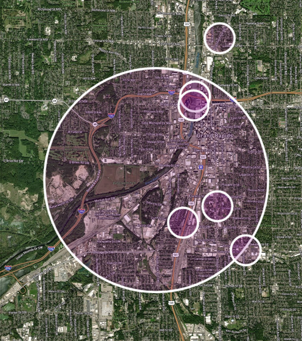

# Junction Models
## *#modeling*
### *How does modeling help solve problems?*

- Models allow us to simulate the outcome of our ideas
- Models allow us to connect complex ideas to the real world
- Models allow us to validate our contributions
- Models allow us to disambiguate things

# Junction Mapping
## *#mapping*
### *How does mapping help solve problems?*

- Mapping allows us to be planful with our neighbors
- Mapping allows us to set a scope for our ideas
- Mapping allows us to collaborate
