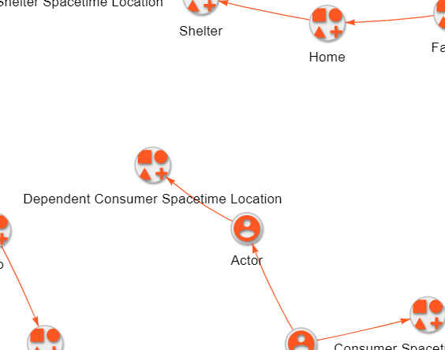

# Junction Models
## *#modeling*
*How does modeling help solve problems?*
- Models allow us to simulate the outcome of our ideas
- Models allow us to connect complex ideas to the real world
- Models allow us to validate our contributions
- Models allow us to disambiguate things

### 1. Problem Solving with Models
#### Method
- Create models that represent the problem
- - The right model shape emerges from true values
- - A bent model shape emerges from disconnected values

